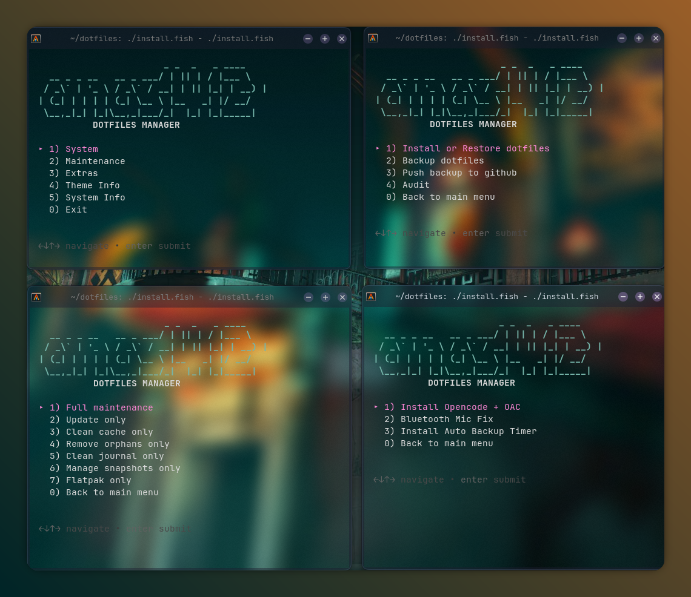

# dotfiles

Managed configs for my CachyOS (Arch Linux) KDE Plasma desktop.

```
       /\        blackbox@blackbox
      /  \       -----------------
     /    \      OS         ➜  CachyOS x86_64
    /      \     Base       ➜  Arch Linux
   /   ,,   \    Kernel     ➜  Linux 7.0.5-2-cachyos
  /   |  |   \   Uptime     ➜  21 hours, 10 mins
 /_-''    ''-_\  Packages   ➜  1425 (pacman)
                 Shell      ➜  fish 4.7.1
                 WM         ➜  KWin (Wayland)
                 Terminal   ➜  alacritty 0.17.0
                 CPU        ➜  Intel(R) Core(TM) i5-10300H (8) @ 4.50 GHz - 77.0°C
                 GPU 1      ➜  NVIDIA GeForce GTX 1650 - 54.0°C [Discrete]
                 GPU 2      ➜  Intel UHD Graphics @ 1.05 GHz [Integrated]
                 Memory     ➜  8.42 GiB / 15.39 GiB (55%)
```



## Requirements

- **Arch Linux** (CachyOS recommended)
- **Fish shell** (required for the scripts)
- **sudo** (for package installs during restore)
- **paru** (for AUR package restore)

## Quick start

Clone and run the installer:

```sh
git clone git@github.com:anas1412/dotfiles.git ~/dotfiles
cd ~/dotfiles
./install.fish
```

## Usage

### Menu-driven (recommended)

```sh
./install.fish
```

```
DOTFILES MANAGER - ANAS1412

Main menu:
  1) System        → Backup / Restore / Audit
  2) Maintenance   → Full / Update / Clean / Orphans / Journal / Snapshots / Flatpak
  3) Extras        → Install Opencode + OAC / Bluetooth Mic Fix / Install Auto Backup Timer
  4) Theme Info    → Display current KDE theme settings
  5) System Info   → Show system info (fastfetch)
  0) Exit
```

### Manual commands

| Action | Command |
|--------|---------|
| **Backup** | `fish scripts/backup.fish` |
| **Audit** | `fish scripts/audit.fish` |
| **Restore** | `fish scripts/restore.fish` |
| **Bluetooth Mic Fix** | `fish scripts/bluetooth-mic-fix.fish` |
| **Maintenance** | `fish scripts/maintenance.fish` |
| **Install Opencode + OAC** | `fish scripts/install-opencode.fish` |
| **Theme Info** | `fish scripts/theme-info.fish` |
| **Install Auto Backup Timer** | `cp systemd/* ~/.config/systemd/user/ && systemctl --user daemon-reload && systemctl --user enable --now dotfiles-backup.timer` |

## What each script does

### `backup.fish`
1. Cleans old snapshots from `config/`
2. Exports native packages to `packages/pacman-native.txt`
3. Exports AUR packages to `packages/pacman-foreign.txt`
4. Copies Fish config from `~/.config/fish`
5. Copies KDE config files (selective safe files)
6. Copies terminal configs (Alacritty, Kitty, Ghostty)
7. Exports KDE theme vars (icons, cursors, color scheme, font) via `kde_style.fish`

### `audit.fish`
Checks system prerequisites and file integrity:
- Required commands (`pacman`, `fish`, `git`, `kwriteconfig5`)
- Directory structure (`scripts/`, `config/`, `packages/`)
- Required files (`pacman.txt`, backup/restore/kde_style scripts, `style.env`)
- KDE runtime config (`kdeglobals`, `kwinrc`, `plasmarc`)

Returns exit code 0 when safe to restore, 1 on warnings.

### `restore.fish`
1. Installs native packages from `pacman-native.txt` via `sudo pacman -S`
2. Installs AUR packages from `pacman-foreign.txt` via `paru -S`
3. Restores Fish config
4. Restores KDE config files
5. Restores terminal configs (Alacritty, Kitty, Ghostty)
6. Applies KDE theme from `style.env` using `kwriteconfig5`

### `bluetooth-mic-fix.fish`
Fixes PipeWire Bluetooth audio when the built-in mic interferes with headset output:
1. Prevents PipeWire from auto-switching to HSP/HFP headset profile (mic takeover)
2. Forces high-quality A2DP codecs (SBC, SBC-XQ, AAC)
3. Sets built-in mic volume to a user-defined level (default 35%)
4. Restarts PipeWire/WirePlumber services

Use this when your Bluetooth earbuds sound muffled or drop to headset mode after a call.

### `maintenance.fish`
System upkeep for Arch/CachyOS with interactive or CLI mode:
- **System update** — updates official repos (`pacman -Syu`) and AUR (`paru -Syu --aur`)
- **Package cache cleanup** — removes uninstalled package caches and keeps last 2 versions
- **Orphan removal** — finds and removes unused dependencies with confirmation
- **Journal log cleanup** — prunes systemd journals by age
- **Snapper snapshot management** — cleans old BTRFS snapshots per config
- **Flatpak maintenance** — updates Flatpaks and removes unused runtimes

Can be run directly with flags:
```sh
fish scripts/maintenance.fish --all       # Run everything
fish scripts/maintenance.fish --update    # System update only
fish scripts/maintenance.fish --orphans   # Orphans only
```

### `install-opencode.fish`
Installs the **opencode CLI** (if missing) and then optionally installs **OpenAgentsControl (OAC)** globally:
1. Checks for `opencode` — installs via `paru -S opencode` (Arch native), falls back to `curl -fsSL https://opencode.ai/install | bash`
2. If opencode CLI is ready, prompts to install OAC from [github.com/darrenhinde/OpenAgentsControl](https://github.com/darrenhinde/OpenAgentsControl)
3. OAC includes agents (OpenAgent, OpenCoder, SystemBuilder), subagents, commands, skills, and context files

Prompts for confirmation before the OAC download.

### `theme-info.fish`
Displays current KDE theme settings in a clean summary:
- Plasma Style, Color Scheme, Window Decorations
- Icon Theme, Cursor Theme
- Widget/Application Style
- Fonts (General, Fixed Width, Menu)
- GTK Theme, Icons, Font
- Splash Screen engine and theme

Reads from KDE config files (`kdeglobals`, `kwinrc`, `plasmarc`, `ksplashrc`) and GTK settings.

## Auto backup timer

Two systemd user units in `systemd/` that run `backup.fish` → commit → push daily:

```
dotfiles-backup.timer     → fires at midnight (or on next boot if PC was off)
dotfiles-backup.service   → backup → git add → git commit → git push
```

If nothing changed, it skips the commit and push — no empty commits, no spam.

**Install via menu:**
```
Extras → 3) Install Auto Backup Timer
```

**Manual install:**
```sh
cp systemd/* ~/.config/systemd/user/
systemctl --user daemon-reload
systemctl --user enable --now dotfiles-backup.timer
```

**Check status:**
```sh
systemctl --user status dotfiles-backup.timer
journalctl --user -u dotfiles-backup.service   # last run log
```

## Restoring on a fresh install

```sh
git clone git@github.com:anas1412/dotfiles.git ~/dotfiles
cd ~/dotfiles
fish scripts/restore.fish
```

> [!NOTE]
> On a completely fresh system, ensure `fish`, `git`, `sudo`, `paru` are installed first. The rest is handled by the restore script.

## Fastfetch config

The custom fastfetch config is at [`config/fastfetch/config.jsonc`](config/fastfetch/config.jsonc). It uses the `arch_small` logo and displays OS, kernel, uptime, packages, shell, WM, terminal, CPU/GPU temps, and memory.
