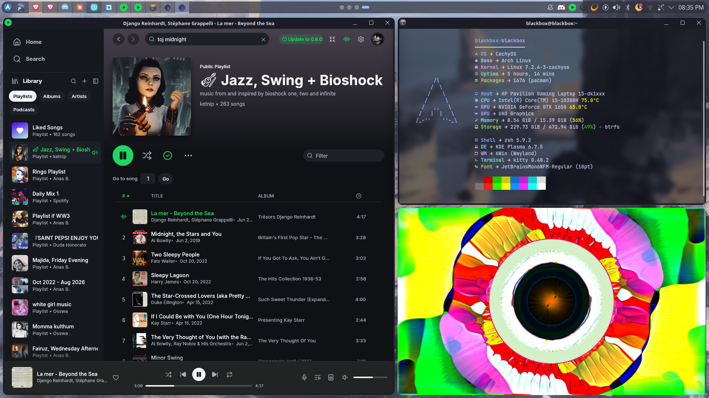

# dotfiles

**Tokyo Night** on Arch (CachyOS) + KDE Plasma 6 / Wayland. Managed with [GNU Stow](https://www.gnu.org/software/stow/).



## Theme

| Layer | Value |
|---|---|
| Palette | Tokyo Night |
| Qt / apps | Kvantum — `Kvantum-Tokyo-Night` |
| Window blur | `kwin-effects-glass` (force blur, rounded corners, refraction) |
| Window decoration | Aurorae — `TokyoNight` |
| UI font | Noto Sans 10 |
| Mono font | JetBrainsMono Nerd Font Mono 10 |
| Terminal | kitty |
| Shell | fish + pure prompt |

Core colors: `#7AA2F7` blue · `#7DCFFF` cyan · `#BB9AF7` purple · `#73DACA` teal · `#9ECE6A` green · `#C0CAF5` fg

## Layout

Each top-level directory is a **stow package** that mirrors your home directory:

```
fish/.config/fish/        ->  ~/.config/fish/
kitty/.config/kitty/      ->  ~/.config/kitty/
alacritty/.config/...     ->  ~/.config/alacritty/
fastfetch/.config/...     ->  ~/.config/fastfetch/
opencode/.config/...      ->  ~/.config/opencode/
claude/.claude/skills/    ->  ~/.claude/skills/   (Claude Code skills, one link per skill)

kde/                      KDE snapshot (copied, not symlinked)
packages/                 installed package lists
bin/                      helper scripts (save/restore KDE, save packages)
scripts/                  standalone fish utilities (maintenance, bluetooth mic fix, ...)
nixos/                    NixOS config generated from this machine — not used on Arch
```

Stow symlinks these into place, so **the files in this repo are the live config**. Edit either side — they're the same file. No syncing, no drift.

## Install on a new machine

```bash
sudo pacman -S stow
git clone https://github.com/anas1412/dotfiles ~/dotfiles
cd ~/dotfiles
./install.sh
```

Only some of it:

```bash
./install.sh fish kitty
```

If a config already exists, stow refuses rather than overwriting. Move the old one aside and re-run.

## KDE

KDE is **not** symlinked. Plasma rewrites `kdeglobals` and `kwinrc` constantly in the background, which would spam the git history with changes you never made. So it's snapshotted on demand instead:

```bash
./bin/save-kde       # after you deliberately change a theme
./bin/restore-kde    # on a new machine, then log out
```

`restore-kde` backs up whatever it replaces to `~/.config/kde-backup-<timestamp>/`.

## Packages

```bash
./bin/save-packages
```

Reinstall on a fresh machine:

```bash
sudo pacman -S --needed - < packages/pacman-native.txt
paru -S --needed - < packages/pacman-foreign.txt
```

## Day to day

Config changes are already in the repo — just commit:

```bash
git add -A && git commit -m "kitty: bump font size" && git push
```

Only KDE and packages need an explicit `save` step first.

## Notes

- `kwin-effects-glass` is a third-party KWin effect built against one exact KWin version. After any KWin update the blur and rounded corners vanish until it is rebuilt: `paru -S --rebuild kwin-effects-glass-git`, then log out and back in.
- `claude/` holds the [taste-skill](https://github.com/Leonxlnx/taste-skill) design skills. Only those are tracked — `~/.claude` also contains credentials, so never stow it whole.

- Terminal font is JetBrainsMono Nerd Font Mono. Without a Nerd Font installed, fastfetch icons render blank.
